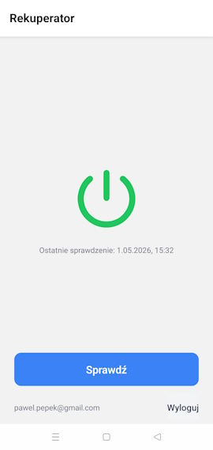

# ReqNot

A mobile app for monitoring a heat recovery ventilator (HRV) on a home network. Sends push notifications when the device stops working.

## Why it exists

The official **ReQnet** app does not send push notifications. A situation where the HRV stops working is unhealthy for residents — without ventilation, CO₂ levels in rooms rise quickly.

ReqNot polls the device every 30 minutes and immediately sends a push notification when the HRV shuts down.

## Screenshot



## Architecture

```
[HRV device] ←── HTTP ──← [ReqNot.WebApi on Raspberry Pi] ──→ Firebase FCM ──→ [Mobile app]
```

- **ReqNot.WebApi** — ASP.NET Core, hosted locally on a Raspberry Pi behind nginx. Polls the HRV every 30 minutes, saves state to Firestore, sends a Firebase push notification when `Values[0] == 0` (device off).
- **reqNot** — React Native / Expo mobile app. Displays current device status, allows manual status checks, and supports Google Sign-In to read data from Firestore.
- **ReqNot.FakeDevice** — HRV simulator for local development.

## Tech stack

- **Backend:** ASP.NET Core 10, Firebase Admin SDK, nginx, systemd (Raspberry Pi)
- **Mobile:** React Native, Expo, TypeScript, Firebase (Auth, Firestore, FCM)
- **Database / notifications:** Google Firestore, Firebase Cloud Messaging

## Device API

The app communicates with the HRV via the ReQnet API. Documentation: https://portal.inprax.pl/REQNET/OpisyAPI_REQNET?ID_TYPU=9

Endpoint: `GET /API/RunFunction?name=CurrentWorkParameters`

```json
{ "CurrentWorkParametersResult": true, "Values": [1, 300, 22.2, ...] }
```

`Values[0]`: 1 = running, 0 = off

## Local development

```bash
# Start the device simulator
dotnet run --project ReqNot.FakeDevice

# Start the backend (uses simulator via appsettings.Development.json)
dotnet run --project ReqNot.WebApi

# Start the mobile app
cd reqNot && npm install && npm start
```

## Deployment (Raspberry Pi)

WebApi runs as a systemd service (`/opt/reqnot/webapi/`), accessible locally via nginx on port 80.

Required production files (gitignored):
- `ReqNot.WebApi/appsettings.Production.json` — HRV address and Firebase key path
- `firebase-serviceaccount.json` — Firebase service account key
- `reqNot/google-services.json` — Firebase config for Android
